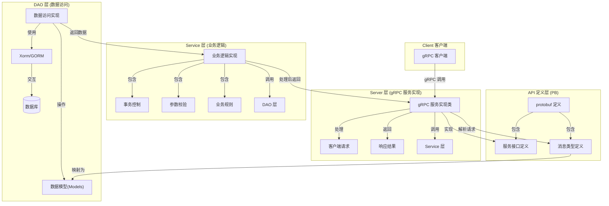

## 包含service层和dao层的gRPC服务架构图



# 自动生成gRPC文件(./pb)
```
protoc --go_out=. --go_opt=paths=source_relative --go-grpc_out=. --go-grpc_opt=paths=source_relative user_growth.proto
```

# protobuf文件来源
    google/api/*.proto 来自 https://github.com/googleapis/googleapis
    google/protobuf/*.proto 来自 https://github.com/protocolbuffers/protobuf

# 生成protoset文件
```
protoc --proto_path=. --descriptor_set_out=myservice.protoset --include_imports ./user_growth.proto
```

# grpcurl调用
```
# 使用gRPC服务
grpcurl -plaintext localhost:80 list
grpcurl -plaintext localhost:80 list UserGrowth.UserCoin
grpcurl -plaintext localhost:80 describe
grpcurl -plaintext localhost:80 describe UserGrowth.UserCoin
grpcurl -plaintext localhost:80 describe UserGrowth.UserCoin.ListTasks
# 使用proto文件
grpcurl -import-path ./ -proto user_growth.proto list
# 使用protoset文件
grpcurl -protoset myservice.protoset list UserGrowth.UserCoin
# 调用gRPC服务
grpcurl -plaintext localhost:80 UserGrowth.UserCoin/ListTasks
grpcurl -plaintext -d '{"uid":1}' localhost:80 UserGrowth.UserCoin/UserCoinInfo
```

# 生成grpc-gateway代码
````
protoc -I . --grpc-gateway_out ./ \
    --grpc-gateway_opt logtostderr=true \
    --grpc-gateway_opt paths=source_relative \
    --grpc-gateway_opt generate_unbound_methods=true \
    user_growth.proto
````
